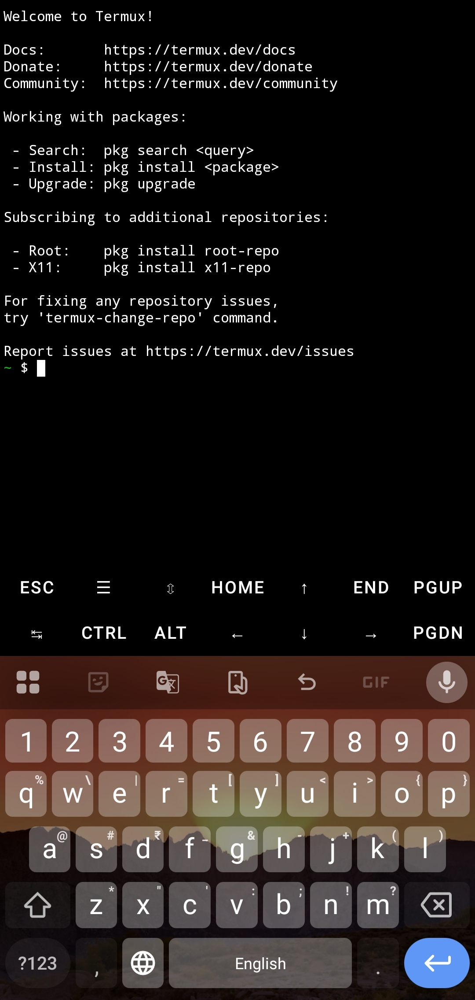

# 📱 Termux Handbook

**Setup, Tools, Development & Advanced Workflows**

> **A comprehensive, safety-focused handbook for Termux: setting it up, using its tools, developing on it, and running advanced workflows**

**📥 Download:** [F-Droid](https://f-droid.org/packages/com.termux/) | [GitHub Releases](https://github.com/termux/termux-app/releases)  
**⚠️ Avoid Google Play:** Heavily restricted builds with limited functionality

---

---

## Table of Contents

### 1. Setup — [index](docs/setup/index.md)
- [Installation](docs/setup/installation.md) — what is Termux, sources, version notes, Play Store build, repos, Termux:GUI
- [First Steps](docs/setup/first-steps.md) — safety warnings, quick start, initial setup
- [Storage & File Management](docs/setup/storage.md) · [Android Storage Access](docs/setup/android-storage.md)
- [Package Management](docs/setup/package-management.md)
- [Customizing Termux](docs/setup/customization.md)

### 2. Tools — [index](docs/tools/index.md)
- Packages: [Essential](docs/tools/packages/essential-packages.md) · [Development & Optional](docs/tools/packages/development-packages.md) · [Networking](docs/tools/packages/networking-packages.md) · [Multimedia](docs/tools/packages/multimedia-packages.md)
- SSH: [Server](docs/tools/networking/ssh/server.md) · [Client](docs/tools/networking/ssh/client.md)
- [curl & wget](docs/tools/networking/curl/README.md) · [wget2](docs/tools/networking/wget2/README.md)
- Downloads: [APKMirror with wget2](docs/tools/downloads/apkmirror/README.md) · [GitHub Releases](docs/tools/downloads/github/releases.md)
- [Termux:API](docs/tools/termux-api.md)

### 3. Development — [index](docs/development/index.md)
- Python: [Setup](docs/development/python/setup.md) · [Virtual Environments](docs/development/python/virtual-environments.md) · [Packages](docs/development/python/packages.md)
- [Node.js](docs/development/nodejs/setup.md) · [Git](docs/development/git/workflow.md) · [Compilation](docs/development/compilation.md)
- [Web Servers](docs/development/web-server/README.md) · [Databases](docs/development/databases/README.md)
- [ADB & Phantom Process Fix](docs/development/android/adb.md)

### 4. Advanced Workflows — [index](docs/advanced-workflows/index.md)
- Proot-Distro: [Overview](docs/advanced-workflows/proot/overview.md) · [Ubuntu](docs/advanced-workflows/proot/ubuntu.md) · [Debian](docs/advanced-workflows/proot/debian.md)
- [Desktop GUI (Termux:X11 & VNC)](docs/advanced-workflows/desktop-gui.md)
- [Background Processes](docs/advanced-workflows/background-processes.md) · [Battery](docs/advanced-workflows/battery.md)
- Self-hosting: [Gitea](docs/advanced-workflows/self-hosting/gitea/README.md) · [Forgejo](docs/advanced-workflows/self-hosting/forgejo/README.md) · [Cloudflare](docs/advanced-workflows/self-hosting/cloudflare/README.md) · [Servers](docs/advanced-workflows/self-hosting/servers/README.md)
- Security: [Permissions & Network](docs/advanced-workflows/security/permissions.md) · [SSH Keys](docs/advanced-workflows/security/ssh-security.md) · [Encryption](docs/advanced-workflows/security/encryption.md) · [Backups](docs/advanced-workflows/security/backups.md) · [AVcleaner](docs/advanced-workflows/security/avcleaner.md) · [Security Tools](docs/advanced-workflows/security/security-tools.md)

### Reference — [index](docs/reference/index.md)
- Troubleshooting: [Common](docs/reference/troubleshooting/common-errors.md) · [Repository](docs/reference/troubleshooting/repository-errors.md) · [Storage](docs/reference/troubleshooting/storage-errors.md) · [Networking](docs/reference/troubleshooting/networking-errors.md) · [Cleanup & Removal](docs/reference/troubleshooting/cleanup-and-removal.md)
- [FAQ](docs/reference/faq.md) · [Resources](docs/reference/resources.md)

### Translations & Project
- [Contributing](CONTRIBUTING.md) · [Changelog](CHANGELOG.md) · [License](LICENSE)

Repository layout: `docs/` (the handbook), `scripts/` (runnable helpers), `examples/` (samples), `translations/`, `assets/`.
---

## Notes

- **Exit commands:** The original script used `exit` after every command block. These have been preserved but can be removed for continuous operation.
- **Battery optimization:** Disable battery optimization for Termux in Android settings to prevent background process termination.
- **F-Droid vs Play Store:** Always use Termux from F-Droid or GitHub. The Play Store version is outdated and deprecated.
- **Google Play versions (2026):** Builds like `googleplay.2026.06.21` are restricted to comply with Play Store policies, though recent ones include built-in Termux API methods. F-Droid/GitHub versions have full functionality.
- **Android 14+ background kills:** turn on **Disable child process restrictions** in Developer Options; see [ADB & Phantom Process Fix](docs/development/android/adb.md).
- **Root access:** Not required for any of these commands. Use `tsu` for root operations only if you have a rooted device.
- **Version managers:** Modern approach (2026) recommends using `mise`, `asdf`, or `uv` for managing multiple language versions instead of installing them all system-wide.
- **Configuration persistence:** `~/.termux/termux.properties` and `~/.termux/colors.properties` should be backed up separately as they define your appearance settings.

---

**Last Updated:** September 2026  
**Termux Stable Version:** 0.118.3 (May 2025)  
**Termux Beta Version:** 0.119.0-beta.3 (May-June 2025)  
**Bootstrap:** 2026.01.11-r1 and newer (latest seen: 2026.08.30-r1)  
**Android Compatibility:** 7.0+ (API 24+)  
**Recommended Source:** F-Droid or GitHub Releases

---

---

## Credits & Contributing

**Guide maintained by:** Community contributors  
**Based on:** Official Termux documentation and community best practices  
**Contributions:** Pull requests welcome

**Special thanks to:**
- Termux development team
- agnostic-apollo (Awesome Termux list)
- All tool developers and maintainers
- Termux community on Reddit and GitHub

---

---

## 📄 License

This guide is provided as-is for educational purposes. Individual tools and packages mentioned have their own licenses.

**Creative Commons Attribution-ShareAlike 4.0 International (CC BY-SA 4.0)** — see [LICENSE](LICENSE). Feel free to share and adapt with attribution, as long as derivatives are shared under the same license.

---

**🌟 Found this helpful? Star the repository! 🌟**

